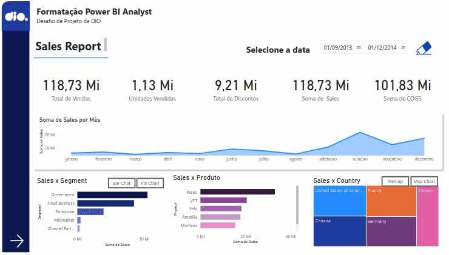

# Sales Report

O Sales Report é um relatório de vendas criado no Power BI, com base na sample Financials disponibilizada pela própria Microsoft. Inclui as primeiras informaçoes da sample e incorpora:
- Estrutura bem definida.
- Botões de navegação para facilitar a exploração.
- Segmentadores e botões com imagens.
- Indicadores e botões para escolher diferentes visuais.

Tal projeto foi criado para um Desafio do Santander Bootcamp 2023 - Ciência de Dados com Python.

  

